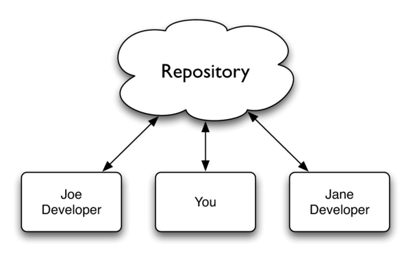
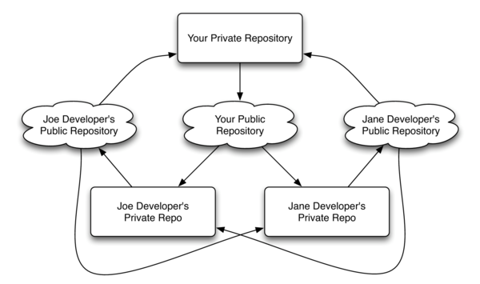
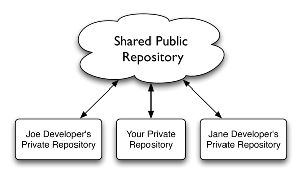

author: Kevin W. Gisi
company: Chicago Code Camp 2&mdash;May 1, 2010 Iowa Code Camp 5&mdash;May 1, 2010
title: Use Git Like a Boss
subtitle:
footer: <a href='http://www.kevingisi.com'>Blog</a> | <a href="http://speakerrate.com/talks/3051-use-git-like-a-boss">SpeakerRate (Chicago)</a> | <a href='http://speakerrate.com/talks/3016-use-git-like-a-boss'>SpeakerRate (Iowa)</a> | <a href="http://github.com/gisikw-slides/use-git-like-a-boss">Source Code</a>
subfooter: Copyright &copy; 2010 by Kevin W. Gisi
slides-url: http://gisikw-slides.github.com/use-git-like-a-boss/
code-engine: uv
code-theme: all_hallows_eve
code-line-numbers: false
twitter-search: #chicagocodecamp+OR+#iowacodecamp

# Summary

Move out Subversion; there's a new man in town. Learn how a decentralized version control system can help make your workflow easier, regardless of what language you use. We'll walk through how to manage a project using Git, and use some branching, tagging, recovery, and a host of other features along the way. Come see how easy it is to branch and merge without the usual headaches.

# Big Day

<iframe src="http://cannonball.heroku.com/" width=90% height=100%></iframe>

# Centralized Versioning

For some version control systems, the structure is centralized. This means that the code is actually hosted on a single server (or cluster of servers). Clients are able to able to pull down copies of the code, and push back changes, but any branching, merging, committing, is all done on a single versioning server. Subversion is an example of a centralized version control system.

# Decentralized Versioning

Decentralized version control sytems such as Git follow a different philosophy. They, in fact, do away with clients. Instead, users are able to create local repositories, and commit, branch, merge all on their own machine. Once they are satisfied with their changes, they can push their repository's commits to another repository, but there is no requirement that there be any single repository that is considered the "master" repository. This has the added benefit of allowing users to make shorter commit cycles, and use the version control system almost like a word-processor's auto-save tool.

# Git in Practice

While Git is a decentralized system, most users tend to use Git in a hybridized manner - each user has a local repository, but there is also a remote repository that acts as a single point from which all users pull updates and push changes. For many, Github is this shared repository.

# Linus's Take on Source Control

Tarballs are better than CVS

# Feature Branching
