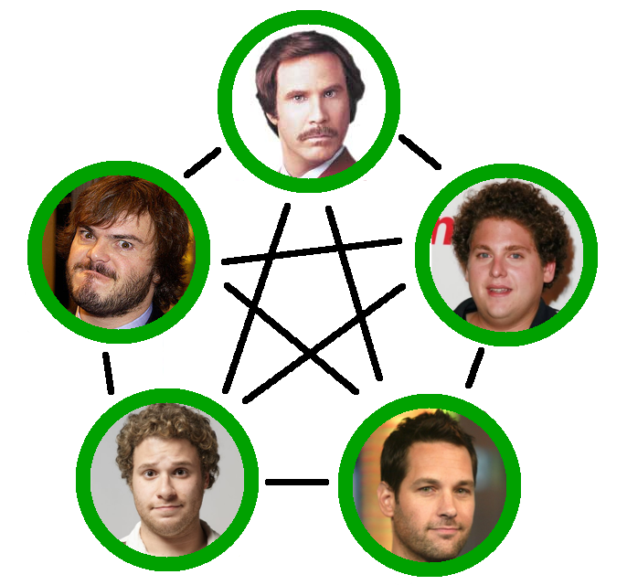

author: Kevin W. Gisi
company: Chicago Code Camp 2&mdash;May 1, 2010 Iowa Code Camp 5&mdash;May 1, 2010
title: Use Git Like a Boss
subtitle:
footer: <a href='http://www.kevingisi.com'>Blog</a> | <a href="http://speakerrate.com/talks/3051-use-git-like-a-boss">SpeakerRate (Chicago)</a> | <a href='http://speakerrate.com/talks/3016-use-git-like-a-boss'>SpeakerRate (Iowa)</a> | <a href="http://github.com/gisikw-slides/use-git-like-a-boss">Source Code</a>
subfooter: Copyright &copy; 2010 by Kevin W. Gisi
slides-url: http://gisikw-slides.github.com/use-git-like-a-boss/
code-engine: uv
code-theme: all_hallows_eve
code-line-numbers: false
twitter-search: iowacodecamp+OR+chicagocodecamp

# Summary

Move out Subversion; there's a new man in town. Learn how a decentralized version control system can help make your workflow easier, regardless of what language you use. We'll walk through how to manage a project using Git, and use some branching, tagging, recovery, and a host of other features along the way. Come see how easy it is to branch and merge without the usual headaches.

# Big Day

<iframe src="http://cannonball.heroku.com/" width=90% height=100%></iframe>

# Use Git Like the Godfather

I'm going to make you an offer you can't refuse

# Centralized Versioning

# Centralized Versioning

# Use Git Like Douglas Reynholm

This is very important. I have a vital meeting to attend, and I've just shot myself in the leg.

# Use Git Like Donald Trump

Let's talk merger.

# Use Git Like Linus Torvalds

I decided I can write something better than anything out there in two weeks. And I was right.

# Basic Git Syntax
<% code :lang => 'shell-unix-generic' do %>
git init
git add .
git commit -am "Initial commit"
<% end %>

# Subsequent Commits
Add then commit:
<% code :lang => 'shell-unix-generic' do %>
git add newfile.txt
git add trackedfile.txt
git commit -m "Updated trackedfile, added newfile"
<% end %>

Shorthand:
<% code :lang => 'shell-unix-generic' do %>
git commit -am "Added all changes to tracked files"
<% end %>

# Distributed Versioning

# Distributed Versioning

- No more tiers
- Will of the people
- Accountability
- Security
- Redundancy

# Grabbing Remote Repositories
Grab a remote repository:
<% code :lang => 'shell-unix-generic' do %>
git clone git://github.com/gisikw-slides/use-git-like-a-boss.git
cd use_git_like_a_boss/
<% end %>

# Collaborating with Remotes
Pull changes:
<% code :lang => 'shell-unix-generic' do %>
git pull origin master
<% end %>
Push changes
<% code :lang => 'shell-unix-generic' do %>
git push origin master
<% end %>

# Use Git Like Mr. Spacely

In the future, we use GitHub!

# Distributed in the Wild

# Distributed in the Community

# Distributed in the Office

# Multiple Working Copies

# Git Branches
<% code :lang => 'shell-unix-generic' do %>
git branch gh-pages
git checkout gh-pages
  #> Switched to branch "gh-pages"
slideshow slides.md
git commit -am "Generated slides"
  #> [master 0adc9ff] Generated slides
  #> 0 files changed, 0 insertions(+), 0 deletions(-)
  #> create mode 100644 slides.html
  #> create mode 100644 slides.pdf
  ...
<% end %>

# Switching Branches
<% code :lang => 'shell-unix-generic' do %>
git checkout master
  #> Switched to branch "master"
ls
  #> slides.md
  #> Rakefile
<% end %>

# Use Git Like Michael Scott

They say a cluttered desk means a cluttered mind.

# Feature-Based Branches

- master
- experimental
- gh-pages
- growl_notifications
- irc_notifications
- remote_control

# Merging Branches

You want my advice? Well I'm not going to give it to ya.

# Merging with Git
<% code :lang => 'shell-unix-generic' do %>
git checkout master
  #> Switched to branch "master"
git merge experimental
  #> Auto-merging conference.rb
  #> Merge made by recursive.
<% end %>

# When Things Go Wrong

CONFLCIT (content): Merge conflict in conference.rb
Automatic merge failed; fix conflicts and then commit the result.

# Conflict Files
<% code :lang => 'ruby' do %>
class Conference
  def best_presentation
<<<<<<< HEAD
    "Kevin's, of course"
=======
    "Ola Bini's talk"
>>>>>>> experimental
  end
end
<% end %>

# Fixed File
<% code :lang => 'ruby' do %>
class Conference
  def best_presentation
    "Kevin's, of course"
  end
end
<% end %>

# Committing the Fix
<% code :lang => 'shell-unix-generic' do %>
git commit -am "Fixed merge conflict, Kevin's presentation is vastly superior"
<% end %>

# Use Git Like Bill Lumbergh

Actually, given that we can merge instantaneously, I'm not gonna need you to come in on Saturday anymore. Yeah..........

# Steal Branches

# Stealing Branches
<% code :lang => 'shell-unix-generic' do %>
git branch --track muwahaha milton/stapler
  #> Branch muwahaha set up to track remote branch stapler from milton.
git checkout muwahaha
  #> Switched to branch 'muwahaha'
<% end %>

# Pushing and Pulling Branches
<% code :lang => 'shell-unix-generic' do %>
git pull milton stapler
  #> Pull the stapler branch into the current system
git push milton stapler
  #> Push the current system to the stapler branch
<% end %>

# Corporate Doesn't Adopt

Bob is excited about Git!

# Use Git Like Bob Kelso

This is not "Take Your Problems to Work Day". It's just "Work Day"

# Git-SVN
<% code :lang => 'shell-unix-generic' do %>
git svn clone https://svn.kde.org/home/kde/trunk/kdesupport/strigi
  #> SCREEN SPAM OF ADDED FILES
cd strigi
...
<% end %>

# Git-SVN
Push commits to Subversion:
<% code :lang => 'shell-unix-generic' do %>
git svn dcommit
<% end %>

Pull changes from Subversion:
<% code :lang => 'shell-unix-generic' do %>
git svn rebase
<% end %>

# Use Git Like Mr. Burns

This is the type of trickery I pay you for.

# Additional Resources

- <a href='http://pragprog.com/titles/tsgit/pragmatic-version-control-using-git'>Pragmatic Version Control Using Git</a> by Travis Swicegood
- <a href='http://help.github.com'>http://help.github.com</a>
- <a href='http://www.gitcasts.com/'>GitCasts</a>

Thank you!

Kevin W. Gisi
&lt;<a href='mailto:kevin@kevingisi.com'>kevin@kevingisi.com</a>&gt;
